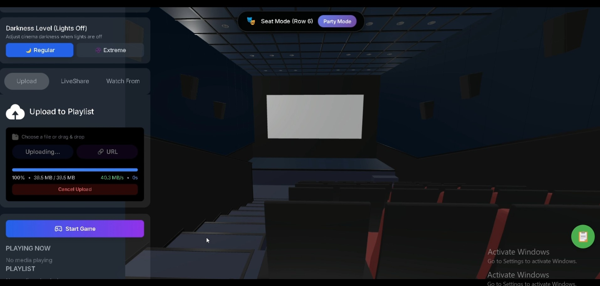
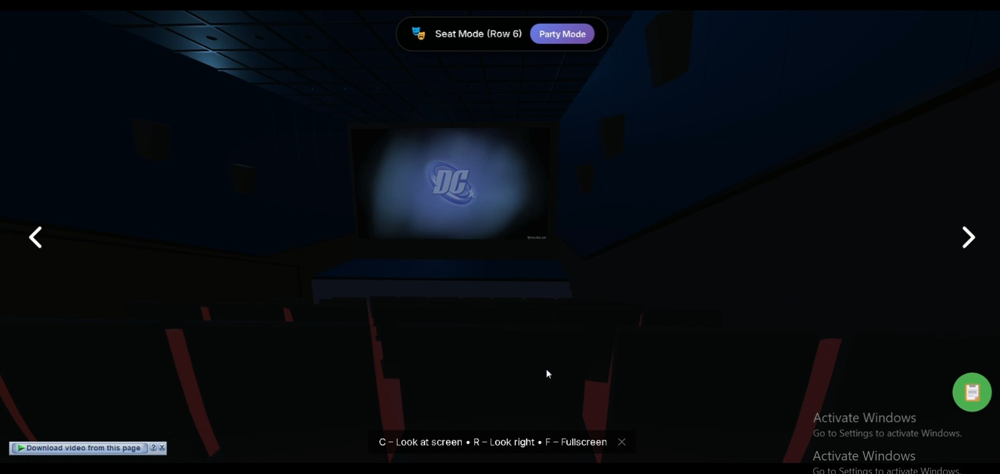
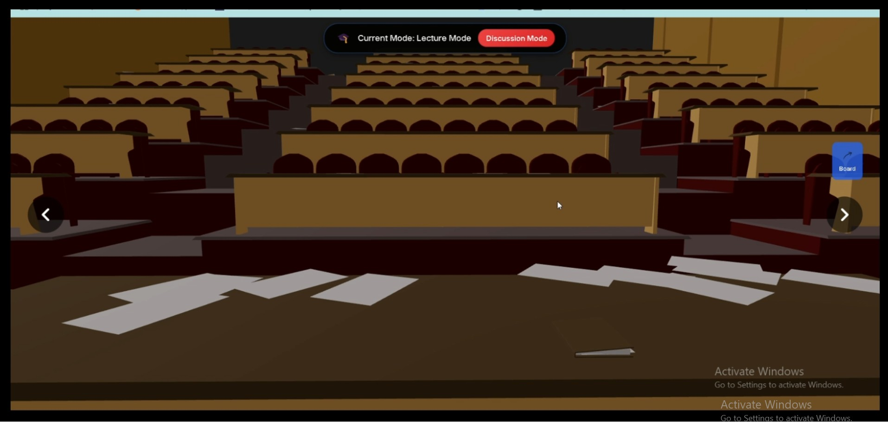

# LetsWatchOut - Social Streaming Platform with 3D Cinema

> Real-time social streaming platform with broadcast features, 3D spatial audio, and live graphics overlays

[](https://reactjs.org/)
[](https://golang.org/)
[](https://www.postgresql.org/)
[](https://threejs.org/)
[](https://livekit.io/)

🚀 **[Live Production App](https://letswatchout.vercel.app)** | 🎥 **[Demo Video](https://drive.google.com/file/d/1l-Eo-RsfAH-2AirOv2UXOVjQr-X7_wEe/view?usp=drive_link)** | 📖 **[Documentation](./documentation/)**

---

## 🌟 Highlights

- **1000+ watch sessions** delivered across beta testing
- **125 sessions per user** average engagement (8 beta testers)
- **₦2,000 pre-launch revenue** (donation system validation)
- **100% positive user feedback** from all beta participants
- **4 LiveShare broadcast modes** (Podcast, News, Show, Regular)
- **Real-time graphics overlays** (ticker, banner, lower thirds, media queue)
- **3D cinema rooms** with spatial proximity audio
- **Full production deployment** (Vercel + Railway)

---

## 🎬 Demo

> **[Watch Demo Video on Google Drive](https://drive.google.com/file/d/1l-Eo-RsfAH-2AirOv2UXOVjQr-X7_wEe/view?usp=drive_link)**

See LetsWatchOut in action: 3D cinema rooms, LiveShare broadcast modes, real-time graphics overlays, and spatial audio.

### 📸 Screenshots

<div align="center">
  
  
  
  
  
</div>

**Features shown:**
- **Login Page**: Clean authentication UI with social/email options
- **3D Cinema (Before Play)**: Theater environment with seats and spatial layout
- **3D Cinema (During Play)**: Active viewing session with synchronized playback
- **Lecture Hall**: Alternative viewing mode for larger audiences (100+ viewers)
- **News Mode**: LiveShare broadcast with ticker, banner, and real-time graphics overlays

---

## ✨ Key Features

### 🎙️ LiveShare Broadcast System
Professional broadcasting tools for content creators:
- **4 Content Modes**: Podcast, News, Show, Regular
- **Auto-adaptive layouts**: Solo, Split (host+guest), Panel (multi-camera)
- **Real-time graphics**: Canvas-based ticker, banner, lower thirds, logo bugs
- **Media queue system**: Image/video playback with auto-advance
- **Guest management**: Invite session members as co-hosts
- **Break mode**: Professional intermission with countdown timer
- **Studio controls**: Complete broadcast dashboard for live graphics

### 🏛️ 3D Cinema Experience
Immersive theater environment powered by Three.js:
- **Realistic cinema rooms**: Procedurally generated seats with dynamic lighting
- **Spatial audio**: Proximity-based voice chat (closer = louder)
- **Avatar system**: Visual presence for all participants
- **TikTok-style mobile view**: Automatic layout adaptation for mobile devices
- **Responsive design**: Full-screen immersion with collapsible UI

### 💬 Real-Time Interaction
WebSocket-powered live features:
- **Live chat**: Real-time messaging with emoji reactions
- **Synchronized playback**: Video/media sync across all viewers
- **Session management**: Instant rooms + scheduled events
- **Viewer presence**: Live join/leave notifications
- **Graphics sync**: Broadcast overlays update for all viewers simultaneously

### 💰 Monetization System
Complete payment infrastructure:
- **Token economy**: Purchase tokens for tips and tickets
- **Host donations**: Viewer tipping with 85/15 revenue split
- **Ticketed sessions**: Paid event hosting
- **Automated payouts**: Stripe Connect + Paystack Transfer API
- **Multi-currency**: USD, NGN, EUR, GBP, GHS, KES support
- **KYC verification**: Identity verification for high-value withdrawals

---

## 🏗️ Architecture

### Tech Stack

**Frontend** (React + Vite)
- React 18.x with modern hooks
- Three.js (3D rendering) + WebGL
- TailwindCSS for responsive UI
- Canvas API for graphics overlays
- WebSocket client for real-time updates
- LiveKit SDK for WebRTC audio/video

**Backend** (Go + Gin)
- Go 1.21+ with Gin web framework
- PostgreSQL 15 with GORM
- WebSocket server (custom implementation)
- LiveKit integration for media streaming
- Stripe + Paystack payment APIs
- JWT authentication + bcrypt

**Infrastructure**
- **Frontend**: Vercel (production deployment)
- **Backend**: Railway (production deployment)
- **Database**: PostgreSQL (managed hosting)
- **Media Storage**: Local filesystem + CDN-ready
- **Real-time**: WebSocket + LiveKit cloud

### System Design Highlights

**Graphics Rendering Architecture**:
- **DOM-based overlays** for podcast/news/show titles (CSS positioned)
- **Canvas-based graphics** for studio controls (ticker, banner, lower thirds)
- **60fps rendering** with requestAnimationFrame loop
- **Responsive text splitting** algorithm for mobile banner rendering

**LiveShare Wizard Flow**:
- 4-step modal: Mode → Setup → Type → Layout
- 8 styling variables lifted to parent state
- localStorage persistence for user preferences
- Auto-layout determination based on guest presence

**Session Management**:
- Instant watch rooms (on-demand)
- Scheduled event rooms (advance tickets)
- Auto-cleanup of stale sessions (24-hour timeout)
- Orphaned media file deletion via transaction handling

---

## 📊 Performance & Scale

**Metrics from Beta Testing**:
- **Concurrent users**: 4 users per room tested
- **Session duration**: Average 15-30 minutes
- **Canvas rendering**: Stable 60fps on mobile devices
- **Component complexity**: 4800-line VideoWatch component (optimized)
- **Database efficiency**: 15+ tables with indexed queries
- **WebSocket latency**: <100ms for graphics updates

**Code Statistics**:
- **Backend**: ~15,000 lines of Go code
- **Frontend**: ~25,000 lines of React/JSX
- **API Endpoints**: 44 payment APIs + 20+ session APIs
- **WebSocket Events**: 30+ event types for real-time sync

---

## 🚀 Getting Started

### Prerequisites
- Go 1.21+ 
- Node.js 18+
- PostgreSQL 15+

### Backend Setup
```bash
cd backend
cp .env.example .env
# Add your environment variables (see documentation/)
go run cmd/server/main.go
# Server running on http://localhost:8080
```

### Frontend Setup
```bash
cd frontend
npm install
npm run dev
# App running on http://localhost:5173
```

### Quick Test
1. Open http://localhost:5173
2. Create account / login
3. Click "Create Room" → Start Instant Watch
4. Try LiveShare mode (camera/screen broadcast)
5. Test graphics overlays in Studio Controls

---

---

## 📚 Documentation

Comprehensive technical documentation in [documentation/](./documentation/) folder:

### Core Features
- **[LIVESHARE_REFINEMENT_PLAN.md](./documentation/LIVESHARE_REFINEMENT_PLAN.md)** - Complete LiveShare system architecture
- **[AUTOMATED_PAYMENTS_COMPLETE.md](./documentation/AUTOMATED_PAYMENTS_COMPLETE.md)** - Payment system overview
- **[INDEX.md](./documentation/INDEX.md)** - Documentation index

### Setup Guides
- **[QUICK_START_PAYSTACK.md](./QUICK_START_PAYSTACK.md)** - 5-minute payment setup
- **[PLATFORM_PAYMENT_SETUP.md](./documentation/PLATFORM_PAYMENT_SETUP.md)** - Complete payment configuration
- **[TESTING.md](./TESTING.md)** - Testing documentation & QA coverage

### API Reference
- **[PAYMENT_API_REFERENCE.md](./documentation/PAYMENT_API_REFERENCE.md)** - 44 payment endpoints
- **[TOKEN_PRICING.md](./backend/TOKEN_PRICING.md)** - Token economics (1 token = $0.10)

---

## 🧪 Testing & Quality

Comprehensive automated testing suite:
- ✅ **Unit Tests**: JWT validation, password hashing, utility functions
- ✅ **Integration Tests**: API endpoints, database operations, payment flows
- ✅ **Security Tests**: Authentication, authorization, data encryption
- ✅ **CI/CD Pipeline**: Automated testing on every commit

**[View full testing docs →](./TESTING.md)**

---

## 📁 Project Structure

```
WeWatch/
├── backend/
│   ├── cmd/server/           # Main entry point
│   ├── internal/
│   │   ├── handlers/         # HTTP request handlers
│   │   │   ├── rooms.go      # Session management (~2000 lines)
│   │   │   ├── liveshare_graphics.go  # Graphics API
│   │   │   └── payments.go   # Payment APIs
│   │   ├── models/           # Database models (15+ tables)
│   │   ├── utils/            # JWT, encryption, helpers
│   │   └── middleware/       # Auth, CORS, logging
│   ├── migrations/           # SQL migrations
│   ├── uploads/liveshare/    # Media uploads (auto-cleanup)
│   └── go.mod
├── frontend/
│   ├── src/
│   │   ├── components/
│   │   │   ├── cinema/
│   │   │   │   ├── VideoWatch.jsx           # Main viewer (4800 lines)
│   │   │   │   ├── 3d-cinema/
│   │   │   │   │   └── CinemaScene3DDemo.jsx  # 3D theater
│   │   │   │   └── ui/
│   │   │   │       ├── LiveShareManager.jsx   # Studio controls
│   │   │   │       └── LiveShareLayoutSelector.jsx
│   │   │   ├── liveshare/
│   │   │   │   └── LiveShareWizard.jsx      # 4-step setup
│   │   │   └── payments/     # 10 payment components
│   │   ├── utils/
│   │   │   └── GraphicsRenderer.js  # Canvas renderer
│   │   └── services/
│   │       └── api.js        # API client
│   └── package.json
└── documentation/            # Technical docs (10+ files)
```

---

## 🎯 Technical Highlights

### Complex State Management
- **VideoWatch component**: 4800+ lines managing video playback, seats, camera, graphics
- **LiveShare wizard**: 8 styling variables lifted to parent with complete data flow
- **Graphics sync**: WebSocket coordination across multiple viewers

### Real-Time Systems
- **WebSocket server**: Custom Go implementation with 30+ event types
- **Graphics renderer**: 60fps canvas overlay with video caching
- **Session cleanup**: Transaction-based media file deletion on room end

### Responsive Design
- **Mobile-first**: TikTok-style detection for vertical video
- **Banner text splitting**: Algorithm for word-boundary text wrapping
- **Dynamic layouts**: Auto-adapt based on screen size and orientation

### Performance Optimization
- **Lazy loading**: 3D assets loaded on demand
- **Video caching**: Break screen media pre-loaded and cached
- **Component splitting**: Modular design for code maintainability
- **Database indexing**: Optimized queries for session lookups

---

## 🔐 Security & Reliability

- **JWT authentication**: Secure token-based auth with refresh tokens
- **Password hashing**: bcrypt with salt
- **Payment verification**: Webhook signature validation (Stripe + Paystack)
- **SQL injection protection**: Parameterized queries via GORM
- **CORS configuration**: Whitelist-based origin control
- **Session cleanup**: Auto-delete stale sessions (24-hour timeout)
- **Media cleanup**: Orphaned file deletion via cron job

---

## 💡 Use Cases

**For Content Creators**:
- Host live podcast interviews with professional graphics
- Run news broadcasts with real-time ticker and breaking news banners
- Stream shows with split-screen guest layouts
- Monetize content through ticketed events and viewer donations

**For Communities**:
- Watch movies together in 3D cinema rooms
- Host watch parties with spatial audio chat
- Create scheduled events with advance ticketing
- Build engaged audiences with real-time interaction

**For Developers**:
- Learn real-time WebSocket architecture
- Study canvas-based graphics rendering
- Understand payment API integration
- Explore 3D web development with Three.js

---

## 🗺️ Roadmap

### ✅ Completed (v1.0)
- [x] Core streaming infrastructure (WebSocket + LiveKit)
- [x] 3D cinema environment with spatial audio
- [x] LiveShare broadcast system (4 modes)
- [x] Real-time graphics overlays (8 types)
- [x] Payment system (44 APIs, dual gateway)
- [x] Automated payouts (Stripe Connect + Paystack)
- [x] Guest management and permissions
- [x] Break mode with countdown timer
- [x] Media queue system
- [x] Mobile responsive design
- [x] Production deployment (Vercel + Railway)

### 🚧 In Progress (v1.1)
- [ ] Admin dashboard for platform management
- [ ] Email notifications (Mailgun integration)
- [ ] Analytics dashboard (session metrics, revenue tracking)
- [ ] User profile customization
- [ ] Advanced media controls (volume, playback speed)

### 📋 Planned (v2.0)
- [ ] AI-powered content recommendations
- [ ] Multi-language support (i18n)
- [ ] Recording/VOD functionality
- [ ] Advanced moderation tools
- [ ] Mobile native apps (React Native)
- [ ] Plugin system for third-party integrations

---

## 🤝 Contributing

This is currently a solo project in active development. Contributions, feedback, and suggestions are welcome!

**Areas for contribution**:
- Frontend components (React)
- Backend APIs (Go)
- Documentation improvements
- Bug reports and feature requests
- Performance optimization
- Testing coverage

---

## 📄 License

MIT License - See LICENSE file for details

---

## 📞 Contact & Support

**Issues**: Please use GitHub Issues for bug reports  
**Documentation**: Check [documentation/](./documentation/) folder first  
**Logs**: Backend logs in `backend/server.log`  

---

## 🙏 Acknowledgments

Built with these amazing open-source technologies:
- [React](https://reactjs.org/) - UI framework
- [Go](https://golang.org/) - Backend language
- [Three.js](https://threejs.org/) - 3D graphics
- [LiveKit](https://livekit.io/) - WebRTC infrastructure
- [PostgreSQL](https://www.postgresql.org/) - Database
- [TailwindCSS](https://tailwindcss.com/) - Styling
- [Stripe](https://stripe.com/) + [Paystack](https://paystack.com/) - Payments

---

**Built with ❤️ for social creators and communities**

*LetsWatchOut - Where watching becomes an experience*

---

**Version**: 1.0.0 (Production)  
**Last Updated**: April 4, 2026  
**Status**: 🟢 Live in production - [Try it now!](https://letswatchout.vercel.app)

